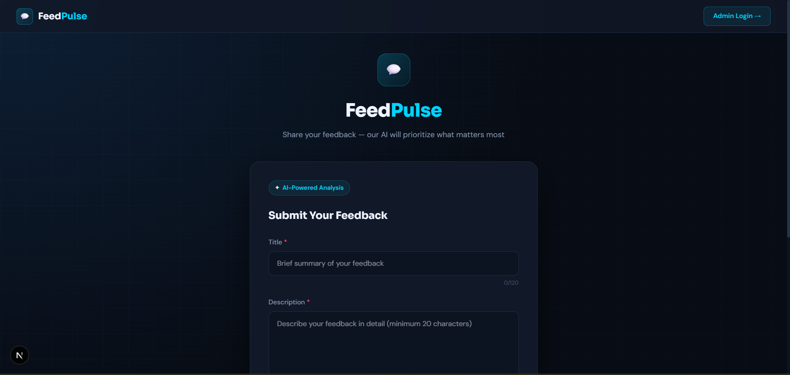
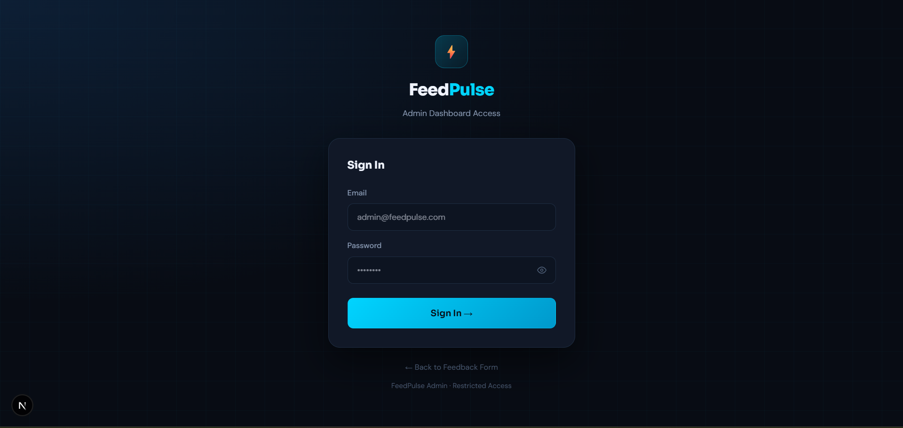
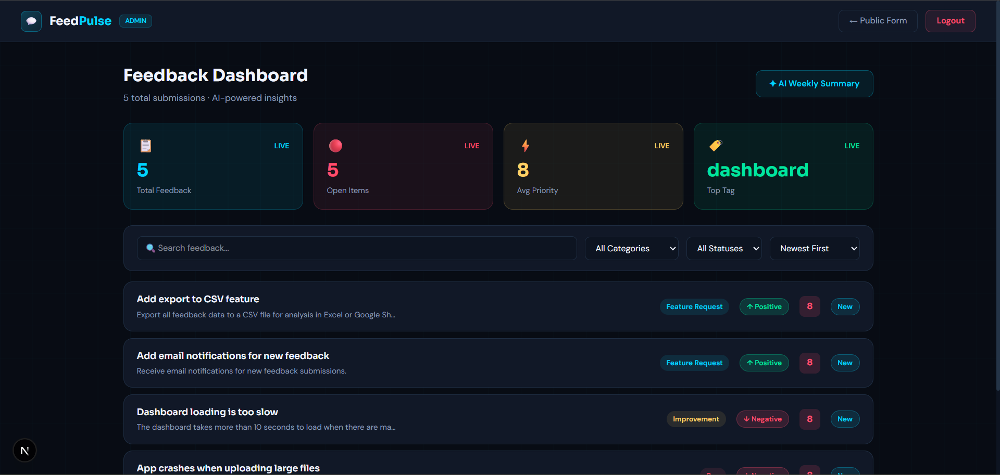
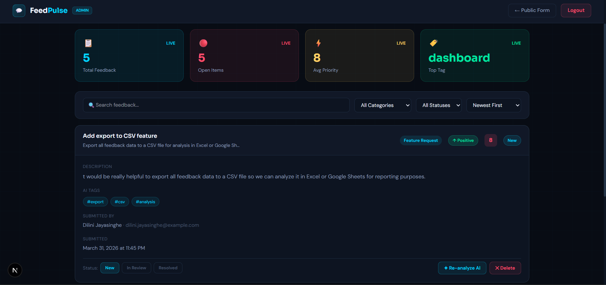

# FeedPulse — AI-Powered Product Feedback Platform


FeedPulse is a lightweight full-stack internal tool that lets teams collect product feedback and feature requests from users, then uses Groq AI (LLaMA 3.1) to automatically categorise, prioritise, and summarise them — giving product teams instant clarity on what to build next.

---

## Screenshots

### Public Feedback Form


### Admin Login


### Admin Dashboard


### Feedback Detail (Expanded)


---

## Tech Stack

| Technology | Purpose |
|---|---|
| Next.js 14+ | Frontend — App Router, React Server Components |
| Node.js + Express | Backend API — REST endpoints, middleware |
| Groq AI (LLaMA 3.1) | AI categorisation, summarisation & priority scoring |
| MongoDB Atlas + Mongoose | Database — feedback, users, AI results |
| JavaScript | Both frontend and backend |
| Tailwind CSS + Custom CSS | Styling — dark modern UI |

---

## Features

### Public Feedback Form
- Clean public page — no login required
- Fields: Title, Description, Category, Name (optional), Email (optional)
- Client-side validation — min 20 chars description, max 120 chars title
- Character counter on description field
- Success and error states after submission
- Rate limiting — max 5 submissions per IP per hour

### AI Analysis (Groq — LLaMA 3.1)
- Auto-triggered on every new submission
- Returns: category, sentiment, priority score (1-10), summary, tags
- Graceful error handling — feedback saved even if AI fails
- Sentiment badge on each feedback card
- Weekly AI summary of top 3 themes
- Admin can manually re-trigger AI analysis

### Admin Dashboard
- Protected — JWT authentication required
- Table/card list with: title, category, sentiment badge, priority score, date
- Filter by category and status
- Sort by date, priority score, or sentiment
- Search by keyword (title + summary)
- Stats bar: total feedback, open items, avg priority, most common tag
- Pagination — 10 items per page
- Update feedback status (New → In Review → Resolved)
- Delete feedback
- AI weekly summary panel

### REST API
- `POST /api/feedback` — Submit feedback (public)
- `GET /api/feedback` — Get all feedback (admin, filters + pagination)
- `GET /api/feedback/:id` — Get single feedback (admin)
- `PATCH /api/feedback/:id` — Update status (admin)
- `DELETE /api/feedback/:id` — Delete feedback (admin)
- `GET /api/feedback/summary` — AI trend summary (admin)
- `GET /api/feedback/stats` — Dashboard stats (admin)
- `POST /api/auth/login` — Admin login
- `POST /api/feedback/:id/reanalyze` — Re-trigger AI (admin)

---

## Project Structure
```
feedpulse/
├── frontend/                  ← Next.js app
│   ├── app/
│   │   ├── page.js            (Public feedback form)
│   │   ├── login/page.js      (Admin login)
│   │   └── dashboard/page.js  (Admin dashboard)
│   ├── components/
│   │   ├── FeedbackForm.jsx
│   │   ├── FeedbackTable.jsx
│   │   ├── StatsBar.jsx
│   │   └── SentimentBadge.jsx
│   └── lib/
│       └── api.js
│
├── backend/                   ← Node.js + Express API
│   ├── src/
│   │   ├── routes/
│   │   │   ├── feedback.js
│   │   │   └── auth.js
│   │   ├── controllers/
│   │   │   ├── feedbackController.js
│   │   │   └── authController.js
│   │   ├── models/
│   │   │   ├── Feedback.js
│   │   │   └── User.js
│   │   ├── services/
│   │   │   └── gemini.service.js
│   │   ├── middleware/
│   │   │   └── auth.js
│   │   └── index.js
│   └── .env.example
│
├── README.md
└── .gitignore
```

---

## How to Run Locally

### Prerequisites
- Node.js 18+
- MongoDB Atlas account (free)
- Groq API key (free — console.groq.com)

### Step 1 — Clone the repository
```bash
git clone https://github.com/samith-shashika/feedpulse.git
cd feedpulse
```

### Step 2 — Setup Backend
```bash
cd backend
npm install
```

Create a `.env` file in the `backend/` folder:
```
PORT=4000
MONGO_URI=your_mongodb_atlas_connection_string
GROQ_API_KEY=your_groq_api_key
JWT_SECRET=your_jwt_secret
ADMIN_EMAIL=admin@feedpulse.com
ADMIN_PASSWORD=admin123
```

### Step 3 — Create Admin User
```bash
# Make sure backend is running first
npm run dev

# In a new terminal, run:
curl -X POST http://localhost:4000/api/auth/setup
```

### Step 4 — Setup Frontend
```bash
cd ../frontend
npm install
```

Create a `.env.local` file in the `frontend/` folder:
```
NEXT_PUBLIC_API_URL=http://localhost:4000
```

### Step 5 — Run the App

In one terminal (backend):
```bash
cd backend
npm run dev
```

In another terminal (frontend):
```bash
cd frontend
npm run dev
```

### Step 6 — Open the App
- **Public Form:** http://localhost:3000
- **Admin Login:** http://localhost:3000/login
- **Admin Dashboard:** http://localhost:3000/dashboard

### Admin Credentials
```
Email: admin@feedpulse.com
Password: admin123
```

---

## Environment Variables

### Backend (`backend/.env`)

| Variable | Description |
|---|---|
| `PORT` | Backend server port (default: 4000) |
| `MONGO_URI` | MongoDB Atlas connection string |
| `GROQ_API_KEY` | Groq AI API key (free at console.groq.com) |
| `JWT_SECRET` | Secret key for JWT tokens |
| `ADMIN_EMAIL` | Admin login email |
| `ADMIN_PASSWORD` | Admin login password |

### Frontend (`frontend/.env.local`)

| Variable | Description |
|---|---|
| `NEXT_PUBLIC_API_URL` | Backend API URL (default: http://localhost:4000) |

---

## What I Would Build Next

If I had more time, I would add:

- **Email notifications** — notify admin when new high-priority feedback is submitted
- **User authentication** — allow users to track their own submitted feedback
- **Analytics page** — charts and graphs showing feedback trends over time
- **Slack/Teams integration** — send AI summaries directly to team channels
- **Feedback voting** — let users upvote existing feedback to show popularity
- **Multi-language support** — accept and analyze feedback in multiple languages
- **Export to CSV** — allow admins to export all feedback data for reporting

---

## 👤 Author

* Name: Samith Shashika
* Email: samithshashika.se@gmail.com
